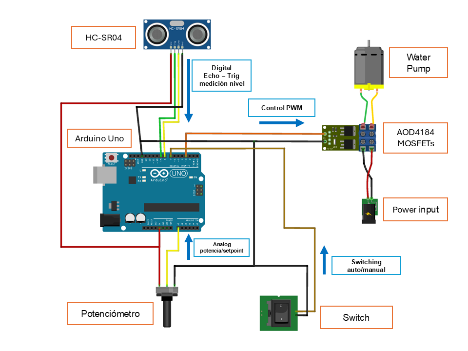
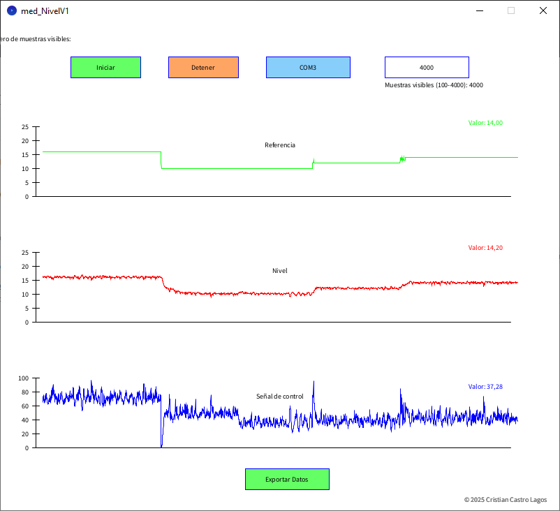
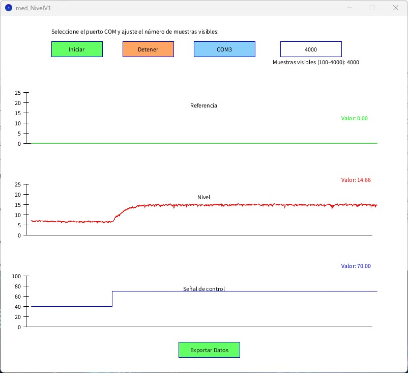
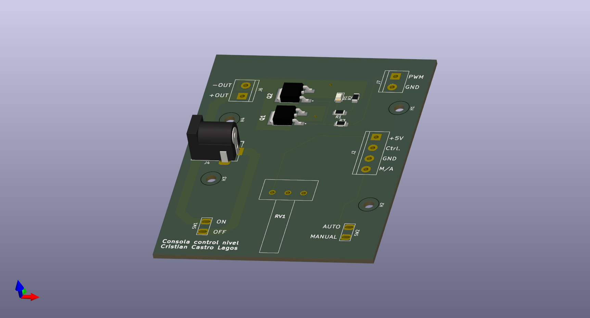
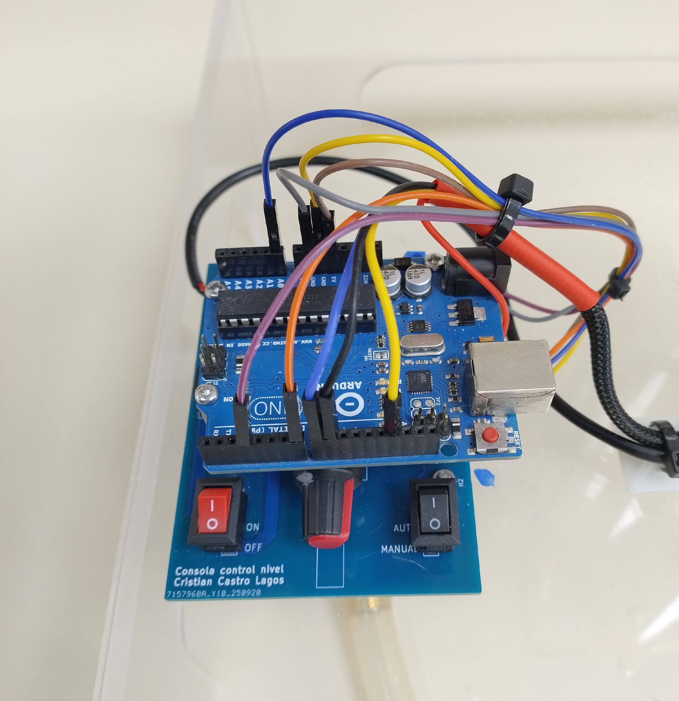

# 🚰 Water Level Control Module

## 📖 Overview
This project focuses on developing a **educational system** for automatic **water level control**.  
The setup allows experiments related to **PID control**, **signal conditioning**, and **embedded systems** using Arduino.  

The system regulates the **tank water level** through a **PWM-controlled pump** driven by MOSFETs, while a **manual/automatic switch** enables user interaction and comparison between open-loop and closed-loop operation.

## 📂 Contents
- `/control_lvl` → C code for Arduino.
- `/docs` → photos

## 📊 Project Status
| Component | Status |
|------------|---------|
| Ultrasonic Sensor (HC-SR04) Integration | ✅ Completed |
| PID Control Loop Implementation | ✅ Completed |
| Power Console PCB (AOD4184 MOSFETs) | ✅ Completed |
| Manual / Automatic Mode Switch | ✅ Completed |
| Processing GUI for Monitoring | ⚙️ In Progress |
| Data Logging Functionality | ⚙️ In Progress |
| Final System Validation | ⚠️ Not Started |


## ⚙️ System Description
- **Controller:** Arduino Uno  
- **Sensor:** HC-SR04 ultrasonic distance sensor  
- **Actuator:** DC water pump  
- **Power Stage:** Custom PCB with two AOD4184 MOSFETs for PWM control  
- **Modes:**  
  - 🧭 *Manual mode:* Level controlled via potentiometer  
  - 🔁 *Automatic mode:* PID-based level regulation  
- **Sampling period:** 0.1 seconds  
- **Data transmission:** Serial output for GUI visualization and logging  

## ⚠️ Serial Communication Issue on Arduino UNO

### 🧩 Overview
The **Arduino UNO** can freeze when the serial connection is interrupted — for example, if you close the Serial Monitor or stop the Processing app while data is being transmitted.  
This issue **does not affect** the **Arduino Leonardo**.

### ⚙️ Technical Cause
- **UNO:** uses a separate USB–Serial chip (**ATmega16U2**).  
  → When the PC closes the port, the main MCU (**ATmega328P**) keeps sending data to a disconnected USB bridge, blocking the serial buffer.  
- **Leonardo:** uses an integrated USB controller (**ATmega32u4**) that detects disconnections and avoids blocking.

🧠 **Additional factor:**  
UNO’s transmit buffer is only **64 bytes**. If `Serial.print()` is used too often or the port is closed, the buffer fills and freezes the loop

### 💡 Recommendation
- Prefer **Arduino Leonardo** or **Teensy** for real-time communication.  
- If using UNO, add checks before sending data:
  
```cpp
if (Serial && Serial.availableForWrite() > 16) {
  Serial.println(sensorValue);
}
```
or
```cpp
if (Serial) {
  Serial.println(sensorValue);
}
```

## 🔄 Control Loop

<p align="center">

</p>


### Controlled Variables
- **Level** → Level value control (stabilization)

## 📐 Digital PID Control

The Module uses a discrete PI controller implemented on a Arduino microcontroller.  
The control law in the digital domain is expressed as:

$$
u(n) = u(n-1) + K_0 e(n) + K_1 e(n-1)
$$

Digital PI controller implemented for level measured,

$$
V_{PWM}(n) = V_{PWM}(n-1) + K_0 e(n) + K_1 e(n-1)
$$

### Parameters:
The parameters are adjusted for temperature measured,

$$
K_0 = K_p + \frac{K_p}{2T_i} T_s
$$

$$
K_1 = -K_p + \frac{K_p}{2T_i} T_s
$$

## 🔉 Signal Processing: Low-Pass IIR Filter (1st Order)

To reduce measurement noise, a **first-order IIR low-pass filter** was applied to the level signal before feeding it to the controller and the model.  

### 🔹 Filter Equation  

$$
y(k) = \alpha \cdot x(k) + (1 - \alpha) \cdot y(k-1)
$$  

Where:  
- $$x(k)$$: raw sensor measurement at time step $$k$$  
- $$y(k)$$: filtered output  
- $$\alpha$$: smoothing factor, $$(0<\alpha<1)$$ 

## :triangular_ruler: Connection Diagram

<p align="center">

</p>

## 🖥️ GUI — Monitoring and Data Logging

The graphical user interface (GUI) shown in the photograph is developed using **Processing 4**.  
It is designed **only for monitoring** the level module in real time and for **recording experimental data**.  

<table>
  <tr>
    <td align="center">
      <br>
      <sub>GUI preview closed loop</sub>
    </td>
    <td align="center">
      <br>
      <sub>GUI preview open loop</sub>
    </td>
  </tr>
</table>

Key features:
- Real-time plot of level and setpoint.
- Display of control output (PWM or equivalent).
- Logging of measurements to files for offline analysis.
- Simple visualization of system behavior during experiments.

> ⚠️ **Note:** The GUI is for observation and data recording only; it does **not** modify the control system or send commands to the hardware.

## ⚡ Power Console PCB
The **custom PCB** integrates:  
- Dual **AOD4184 MOSFETs** for high-efficiency PWM control  
- Manual/automatic mode switch  
- Potentiometer for manual reference adjustment  
- Connector headers for Arduino and sensor interface  

## 🖼️ Render 3D PCB 

<p align="center">

</p>

## ⚡Physical  Prototype

<table>
  <tr>
    <td align="center">
      <br>
      <sub>PCB assembled</sub>
    </td>
    <td align="center">
      <br>
      <sub>PCB assembled in process</sub>
    </td>
    <td align="center">
      <br>
      <sub>Setup overview</sub>
    </td>
  </tr>
</table>


## 📜 License
MIT License © 2025  
